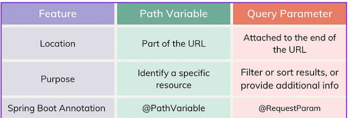
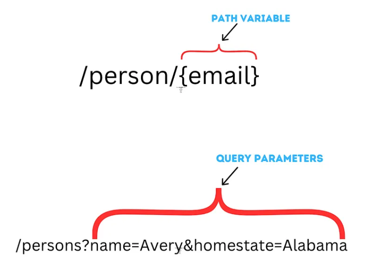

**In short**: when dealing with a single, specific item, like the unique ball(item), use a path variable. When filtering by attributes like ball color(which contains more items), use a query parameter. 

**The differences**: 

**A nice figure**:

Just read this: **https://medium.com/@averydcs/understanding-path-variables-and-query-parameters-in-http-requests-232248b71a8**