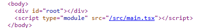
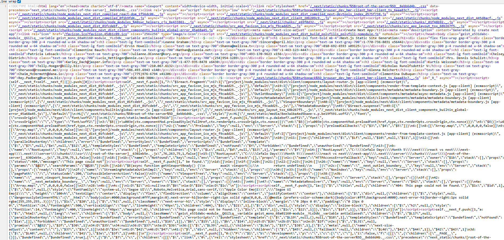

## 1. Rendering Strategy

In the react there occurs client-side rendering. Where all the element come as a `JS bundle` with a `root div` after hitting a specific URL (e.g `http://localhost:5173/`). And then all the html code of each JS file view within that root div. And for this reason it takes time to load data. And if you right-click and go `view-page source` you can visualize it.

So for this reason, SEO is hard in react app.

On the other hand, in next application, after hitting an URL, all the element come without any loading using the `static site rendering` (a part of pre-rendering) operation. And that's why we get the element before loading. And so why, the SEO is easier here. You can visualize it in the same way.

| Feature                   | React (CSR)                                       | Next.js (SSG)                                            |
| ------------------------- | ------------------------------------------------- | -------------------------------------------------------- |
| Rendering Time            | On the client side after JavaScript loads         | At build time on the server                              |
| Initial HTML              | Minimal HTML; content is injected after hydration(loading) | Full HTML with data is generated and sent to the browser |
| SEO                       | Poor (search engines may not see dynamic content) | Excellent (fully rendered HTML is indexable)             |
| Time to First Paint (TTP) | Slower (user sees blank screen initially)         | Faster (content visible immediately)                     |

---

## 2. Data Fetching

| Feature             | React (CSR)                         | Next.js (SSG)                                  |
| ------------------- | ----------------------------------- | ---------------------------------------------- |
| Data Fetch Location | Browser                             | Server (during build)                          |
| Data Freshness      | Always fresh                        | Stale until next rebuild or revalidation setup |
| API Call Visibility | Visible in network tab in dev tools | Not visible (server-side call during build)    |
| Flexibility         | Can handle real-time updates easily | Requires revalidation or rebuild for new data  |

---

## 3. Performance

| Aspect          | React (CSR)                              | Next.js (SSG)                                  |
| --------------- | ---------------------------------------- | ---------------------------------------------- |
| First Load Time | Slower due to JS bundle and client fetch | Faster because content is already rendered     |
| Caching         | Browser-level caching                    | Can be statically hosted and CDN cached easily |
| JS Bundle Size  | Larger initially                         | Slightly reduced as rendering is on the server |
| Core Web Vitals | Often lower                              | Generally higher with proper setup             |

---

## 4. User Experience

| Aspect                | React (CSR)                             | Next.js (SSG)                                  |
| --------------------- | --------------------------------------- | ---------------------------------------------- |
| Loading UX            | Needs loading spinner or skeleton UI    | Content visible instantly without placeholders |
| Navigation            | Fast (CSR-based navigation)             | Fast (handled by Next.js router)               |
| Offline Support       | Requires manual setup                   | Easy with static export                        |
| Perceived Performance | Lower due to delay in content rendering | Higher due to instant visibility               |

---

