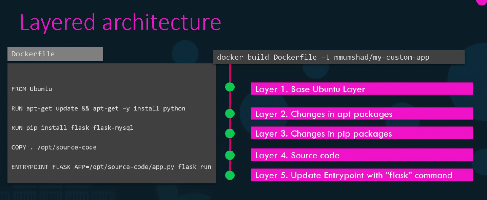

# Dockerfile

A Dockerfile is a plain text file defining a series of instructions and arguments that Docker interprets to create an image.The structure (layered) of a Dockerfile is as follows:

- `FROM`: Sets the base image—in this case, Ubuntu. Every Dockerfile begins with a FROM instruction referencing an existing image on Docker Hub.
- `RUN`: Executes commands in the container. In the Dockerfile, the first RUN command updates the package lists and installs necessary packages. Combining commands with && minimizes the image layers.
- `COPY`: Transfers files from your local system into the image. Here, it copies the source code to /opt/source-code.
- `ENTRYPOINT`: Specifies the command that runs when the container starts. In this example, it sets the environment variable FLASK_APP and starts the Flask web server.