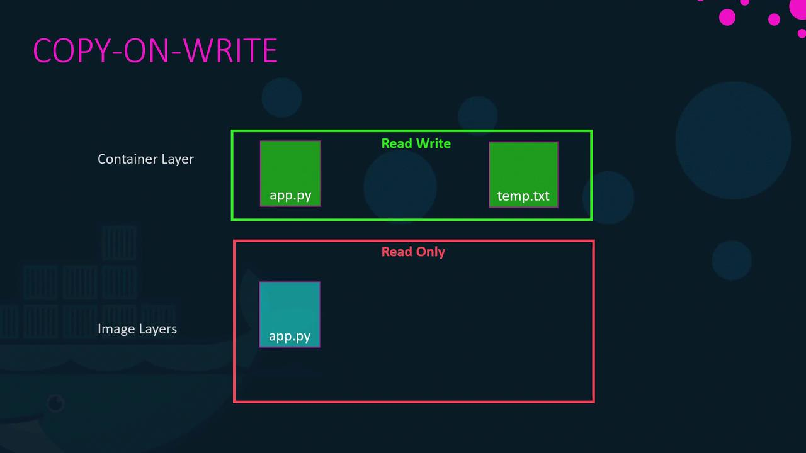
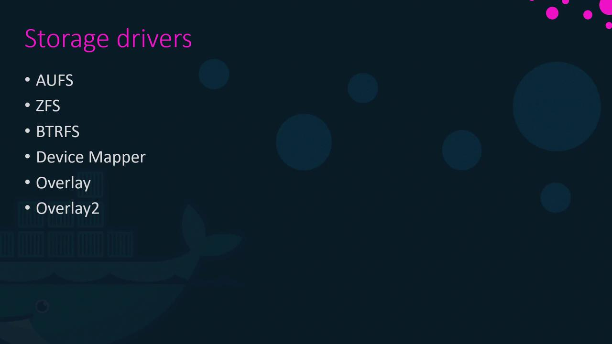

# docker engine

Docker Engine is an open-source containerization technology that enables developers to build, ship, and run applications in lightweight, portable containers. It provides a consistent environment for applications, regardless of where they are deployed, making it easier to manage dependencies and configurations.

## Docker Engine Architecture in Windows

Docker Engine on Windows uses a client-server architecture. The Docker client communicates with the Docker daemon (server) to build, run, and manage containers. The Docker daemon runs on a LinuxKit VM in Windows, which provides a lightweight Linux environment for running containers.

# Docker's File Storage Architecture

When Docker is installed, it establishes a directory structure typically at /var/lib/docker. This root directory contains several subdirectories that serve different purposes:

- `containers`: Stores files related to running containers.
- `images`: Contains image-related files.
- `volumes`: Holds data for Docker volumes.
- `overlay2`: Manages the overlay filesystem for layering.

## Docker's Layered Architecture

Docker images are constructed using a layered approach. Each instruction in a Dockerfile creates a distinct layer that only contains changes from the previous layer. For example, consider the following Dockerfile:

**Dockerfile 1:**

```bash
FROM ubuntu
RUN apt-get update && apt-get -y install python
RUN pip install flask flask-mysql
COPY . /opt/source-code
ENTRYPOINT ["flask", "run"]
```

Build the image using:

```bash
docker build -t mummshad/my-custom-app .
```

In this Dockerfile:

- `Base Image`: The first layer pulls the Ubuntu base image.
- `APT Packages`: The second layer installs necessary APT packages.
- `Python Packages`: The third layer installs Python packages required by the application.
- `Source Code`: The fourth layer copies your application code into the container.
- `Entrypoint`: The final layer sets the container's entry point.

Because each layer contains only the incremental changes, their sizes reflect only the modifications from the previous layer. For instance, even if the base Ubuntu image is large, layers that add extra packages or code remain relatively small.

**Dockerfile 2**:

```bash
FROM ubuntu
RUN apt-get update && apt-get -y install python
RUN pip install flask flask-mysql
COPY app2.py /opt/source-code
ENTRYPOINT ["flask", "run"]
```

Build both the images using:

```bash
docker build -t mummshad/my-custom-app .
docker build -t mummshad/my-custom-app2 .
```

Since the first three layers are identical in both Dockerfiles, Docker reuses the cached layers, significantly speeding up the build process and saving disk space. Even when updating application code, only the modified layers are rebuilt.

## Understanding Image Layers

Visualize the image layers from the base to the top:

```bash
Base Ubuntu layer.
APT package installation.
Python and Flask dependencies.
Application source code.
Entrypoint setup.
```

Once built, these layers are **read-only**. When you run a container from the image, Docker adds a new, writable layer on top. This writable layer captures any changes made during runtime—be it log files or temporary modifications. For instance, executing:

```bash
docker run mummshad/my-custom-app
```

Within the container, if you modify a file (for example, creating `temp.txt`), Docker uses a copy-on-write mechanism: it copies the original file to the writable layer and then applies any changes. When the container stops or is removed, this writable layer is also discarded.



## Data Persistence in Docker

So to persist the data, Docker provides **volumes** and **bind mounts**. `Volumes` are stored in the `/var/lib/docker/volumes/` directory on the host machine. They are managed by Docker and can be easily created, backed up, and shared between containers. 

On the other hand, `Bind mounts` allow you to mount a specific file or directory from the host machine into a container. This is useful for development purposes, as it allows you to edit files on the host and see the changes reflected in the container immediately.

for example, to create a volume and mount it to a container, you can use the following command:

```bash
docker volume create my-volume
docker run -d -v my-volume:/data my-image
```

If you specify a volume that does not yet exist, such as `my-volume2`, Docker will automatically create it and mount it:

```bash
docker run -d -v my-volume2:/data my-image
```

If we want to use bind mounts, we can use the following command:

```bash
docker run -d -v /path/on/host:/path/in/container my-image
```

While the `-v` syntax is common, the newer and preferred method is using the `--mount` option, which provides a more explicit and versatile configuration:

```bash
docker run \
  --mount type=bind,source=/data/mysql,target=/var/lib/mysql \
  mysql
```

## Docker Storage Drivers

Docker storage drivers manage the layered filesystem, create writable layers, and implement the copy-on-write mechanism. Popular storage drivers include AUFS, VTRFS, VFS, Device Mapper, Overlay, and Overlay2. The default driver is determined by your operating system and kernel support. For instance, modern Ubuntu installations often use Overlay2, while Fedora or CentOS might use Device Mapper.

Each driver offers different performance and stability characteristics, so it’s essential to choose the one that best meets your application needs. For more detailed insights on these storage drivers, please refer to their official documentation.
