# The Ultimate Flow: Frontend to Backend Architecture

## 🎯 Complete Data Flow Journey
*How data travels from user interaction to database and back*

---

## 📊 Flow Chart

```mermaid
graph TD
    A[👤 User Interaction] --> B[🖥️ Frontend React Component]
    B --> C[⚡ React Query Mutation]
    C --> D[🌐 API Call]
    D --> E[📡 HTTP Request POST /api/endpoint]
    
    E --> F[🎯 NestJS Controller]
    F --> G[🏭 Service Layer]
    G --> H[🔄 Mapper DTO→Entity]
    H --> I[📦 Repository Layer]
    I --> J[🔧 Prisma ORM]
    J --> K[🗄️ Database]
    
    K --> L[📤 Database Response]
    L --> M[🔧 Prisma Result]
    M --> N[📦 Repository Return]
    N --> O[🔄 Mapper Entity→DTO]
    O --> P[🏭 Service Response]
    P --> Q[🎯 Controller Response]
    
    Q --> R[📡 HTTP Response]
    R --> S[🌐 Frontend API Response]
    S --> T[⚡ React Query Success]
    T --> U[🖥️ UI Update]
    U --> V[👤 User Sees Result]
```



---

## 🏗️ Layer-by-Layer Breakdown

### 1. 🖥️ **Frontend Layer**

#### **React Component** (`Component.tsx`)
```typescript
const handleAction = async (inputData: string) => {
  try {
    const result = await createMutation.mutateAsync({
      id: selectedItem.id,
      text: inputData.trim(),
      author: user?.name,
    });
    setItems([result, ...items]);
  } catch (error) {
    console.error('Failed to save data:', error);
  }
};
```
**Role**: Handles user interactions and UI state management

#### **React Query Mutation** (`useMutations.ts`)
```typescript
export const useCreateData = () => {
  return useMutation({
    mutationFn: ({ id, text, author }) => 
      createData({ id, text, author }),
    onSuccess: () => {
      message.success('Data saved successfully');
      queryClient.invalidateQueries({ queryKey: ['dataList'] });
    },
  });
};
```
**Role**: Manages API calls, caching, loading states, and error handling

#### **API Layer** (`api.ts`)
```typescript
export const createData = async (data: CreateDataType) => {
  const URL = '/api/endpoint';
  return await postData(URL, data);
};
```
**Role**: Makes HTTP requests to backend endpoints

---

### 2. 🌐 **HTTP Layer**

#### **Request**
```http
POST /api/endpoint
Content-Type: application/json

{
  "id": 123,
  "text": "Sample data!",
  "author": "John Doe"
}
```

#### **Response**
```http
HTTP/1.1 201 Created
Content-Type: application/json

{
  "id": 456,
  "parent_id": 123,
  "text": "Sample data!",
  "author": "John Doe",
  "timestamp": "2025-11-07T10:30:00.000Z",
  "created_at": "2025-11-07T10:30:00.000Z",
  "updated_at": "2025-11-07T10:30:00.000Z"
}
```

---

### 3. 🎯 **Backend Controller Layer**

#### **Controller** (`controller.ts`)
```typescript
@Controller('api/endpoint')
export class DataController {
  @Post()
  create(@Body() createDto: CreateDataDto): Promise<DataResponseDto> {
    return this.dataService.create(createDto);
  }
}
```
**Role**: 
- Routes HTTP requests to appropriate service methods
- Handles request/response serialization
- Applies decorators for validation and documentation

---

### 4. 🏭 **Service Layer**

#### **Service** (`service.ts`)
```typescript
async create(createDto: CreateDataDto): Promise<DataResponseDto> {
  try {
    // 1. Validate business rules
    const parentExists = await this.dataRepository.parentExists(
      createDto.parent_id
    );
    if (!parentExists) {
      throw APIException.fromAppError(PARENT_NOT_FOUND);
    }

    // 2. Convert DTO to Entity
    const entityData = this.dataMapper.fromCreateDtoToEntity(createDto);
    
    // 3. Save to database
    const data = await this.dataRepository.create(entityData);
    
    // 4. Log success
    this.logger.log(`Data created successfully: ${data.id}`);

    // 5. Convert Entity to Response DTO
    return this.dataMapper.fromEntityToDto(data);
  } catch (error) {
    this.logger.error('Failed to create data', error);
    throw APIException.fromAppError(DATA_CREATION_FAILED);
  }
}
```
**Role**: 
- Contains business logic and validation
- Orchestrates data flow between layers
- Handles error management and logging
- Coordinates with mappers and repositories

---

### 5. 🔄 **Mapper Layer**

#### **Mapper** (`mapper.ts`)
```typescript
export class DataMapper {
  // DTO → Entity (for database operations)
  fromCreateDtoToEntity(dto: CreateDataDto): CreateDataEntity {
    return {
      parent_id: dto.parent_id,
      text: dto.text,
      author: dto.author
      // Note: id, created_at, updated_at auto-generated by database
    };
  }

  // Entity → Response DTO (for API responses)
  fromEntityToDto(entity: DataEntity): DataResponseDto {
    return {
      id: entity.id,
      parent_id: entity.parent_id,
      text: entity.text,
      author: entity.author,
      timestamp: entity.created_at.toISOString(), // Format for frontend
      created_at: entity.created_at,
      updated_at: entity.updated_at
    };
  }

  // Array mapping
  fromEntityListToDto(entities: DataEntity[]): DataResponseDto[] {
    return entities.map(entity => this.fromEntityToDto(entity));
  }
}
```
**Role**: 
- **Data Translator**: Converts between different data formats
- **Format Adapter**: Adapts external API format to internal database format
- **Single Responsibility**: Handles only data transformation logic

---

### 6. 📦 **Repository Layer**

#### **Repository** (`repository.ts`)
```typescript
export class DataRepository {
  async create(data: CreateDataEntity): Promise<DataEntity> {
    return await this.prisma.data_table.create({
      data: data,
    });
  }

  async findById(id: number): Promise<DataEntity | null> {
    return await this.prisma.data_table.findUnique({
      where: { id },
    });
  }

  async parentExists(parentId: number): Promise<boolean> {
    const count = await this.prisma.parent_table.count({
      where: { id: parentId },
    });
    return count > 0;
  }
}
```
**Role**: 
- **Database Abstraction**: Provides clean interface to database operations
- **Query Management**: Handles complex database queries
- **Data Access**: Only layer that directly communicates with database

---

### 7. 🔧 **ORM Layer (Prisma)**

#### **Generated Prisma Client**
```typescript
// Auto-generated by Prisma
await prisma.data_table.create({
  data: {
    parent_id: 123,
    text: "Sample data!",
    author: "John Doe"
  }
});
```
**Role**: 
- **Type Safety**: Provides TypeScript types for database operations
- **Query Builder**: Converts method calls to SQL queries
- **Connection Management**: Handles database connections and transactions

---

### 8. 🗄️ **Database Layer**

#### **Actual SQL Execution**
```sql
INSERT INTO data_table 
(parent_id, text, author, created_at, updated_at) 
VALUES (123, 'Sample data!', 'John Doe', NOW(), NOW());

-- Returns inserted record with auto-generated id
```
**Role**: 
- **Data Persistence**: Stores data permanently
- **Data Integrity**: Enforces constraints and relationships
- **ACID Compliance**: Ensures transaction reliability

---

## 🔄 **Return Journey (Database → Frontend)**

### **Reverse Flow**
```
Database Result → Prisma Entity → Repository Return → Mapper (Entity→DTO) 
→ Service Response → Controller JSON → HTTP Response → Frontend API → 
React Query → Component State → UI Update
```

---

## 🎭 **Real-World Analogy**

Think of this flow like **ordering food at a restaurant**:

1. **👤 Customer (User)**: "I want to create some data"
2. **🍽️ Waiter (Frontend)**: Takes your request and writes it down
3. **📋 Order System (API)**: Processes the request format
4. **👨‍🍳 Kitchen Manager (Service)**: Validates ingredients are available
5. **📝 Recipe Card (Mapper)**: Converts request to kitchen format
6. **🔥 Cook (Repository)**: Actually prepares the data
7. **🍳 Kitchen Equipment (Prisma)**: Tools used for processing
8. **🥘 Ingredients (Database)**: Raw materials stored in storage

**Return Journey**: Data is formatted, passed back through the same chain, and served to customer!

---

## 🏆 **Benefits of This Architecture**

### **🔧 Separation of Concerns**
- Each layer has ONE specific responsibility
- Easy to test, maintain, and modify individual layers

### **🔄 Scalability**
- Can replace any layer without affecting others
- Easy to add caching, monitoring, or other features

### **🛡️ Security**
- Validation at multiple layers
- Data sanitization and transformation

### **🎯 Maintainability**
- Clear data flow makes debugging easier
- Changes in one layer don't break others

### **🔁 Reusability**
- Mappers and repositories can be reused across features
- Services contain reusable business logic

---

## 📝 **Key Takeaways**

1. **Each layer is a specialist** - does one thing really well
2. **Data transformation happens at boundaries** - via mappers
3. **Business logic lives in services** - not in controllers or repositories
4. **Frontend and backend are loosely coupled** - communicate via clean APIs
5. **Error handling cascades properly** - from database to user interface

This architecture ensures **clean, maintainable, and scalable** applications! 🚀